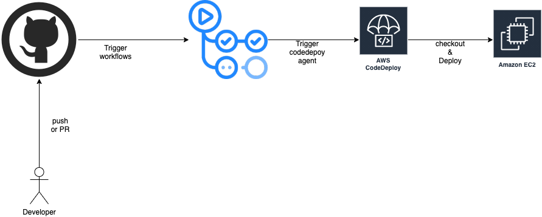

# Github Actions을 활용한 CI

## Github Actions + EC2 + CodeDeploy
EC2 instance에 codedeploy를 활용한 CI.
Trigger만 동작시키는 것으로 현재 자원을 활용하여 간단하게 사용.
무중단 배포를 원할 경우 서버증설 및 서브 작업 필요.

### Prerequsite
- EC2 Instance
- Github Repository
- IAM User (CodeDeployFullAccess 권한 필요)

### 배포 과정
1. github repository에 push/pr등을 한다.
2. 설정한 이벤트를 감지하면 github action workflow에 정의한 작업이 실행된다.
3. Codedeploy를 사용하여 github source를 EC2 인스턴스로 checkout한다.
4. checkout 후 codedeploy agent가 appspec에 정의한 추가 작업을 실행한다.

### 실행 방법
1. EC2 Instance에 CodeDeploy Agent를 설치.
   - [aws codedeploy document 참고](https://docs.aws.amazon.com/ko_kr/codedeploy/latest/userguide/codedeploy-agent-operations-install.html)
   ~~~bash
   # ubuntu 18.04LTS 기준
   sudo apt-get update
   sudo apt-get install ruby
   sudo apt-get install wget
   cd /home/ubuntu
   wget https://aws-codedeploy-ap-northeast-2.s3.ap-northeast-2.amazonaws.com/latest/install
   chmod +x ./install
   sudo ./install auto
   ~~~
2. EC2 Instance에 IAM role 설정
   - AWSCodeDeployFullAccess 권한을 가지는 IAM Role 생성.
   - 해당 Role을 EC2 Instance에 적용.
3. CodeDeploy Provisioning
   - ./terraform/modules/codedeploy 에 정의됨.
4. CodeDeploy와 github Repository 연동
   - CodeDeploy 콘솔에서 작업 필요.
   - 한번만 연동하면 되며 아래 링크 참고.
   - [참고](https://docs.aws.amazon.com/ko_kr/codedeploy/latest/userguide/deployments-create-cli-github.html)
5. github action workflows 작성
   - .github/workflows/ci-ec2.yml
6. codedeploy 스크립트 작성
   - appspec.yml > codedeploy agent가 해당 파일의 작업 수행
   - app/scripts 경로의 shell script 작성 > hook에 사용되는 스크립트, 아래 링크 참고.
   - [참고](https://docs.aws.amazon.com/ko_kr/codedeploy/latest/userguide/reference-appspec-file-structure-hooks.html#appspec-hooks-server)

## Github Actions + ECS
이미 서비스 되고 있는 ECS에 대해 task를 재정의 하여 배포

### Prerequsite
- ECS
- Github Repository
- IAM User (ECR, ECS에 대한 권한 필요)

### 배포 과정
1. github repository에 push/pr등을 한다.
2. 설정한 이벤트를 감지하면 github action workflow에 정의한 작업이 실행된다.
3. 배포할 소스에 대한 이미지를 빌드하여 ECR에 push한다.
4. 새롭게 빌드한 이미지를 작업 정의에 새롭게 렌더링 하여 ECS 에 배포한다.
5. 필요한 환경에 대한 정보는 appspec.yml 을 이용한다.

### 실행 방법
1. 작업 정의에 필요한 json 파일 작성.
   - ECS Task Definition 참고
   - ./app/task-definition.json.sample 참고

